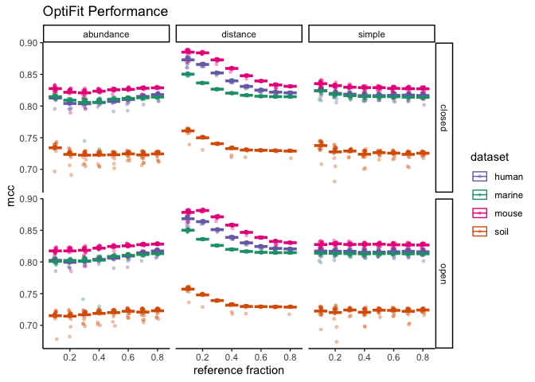
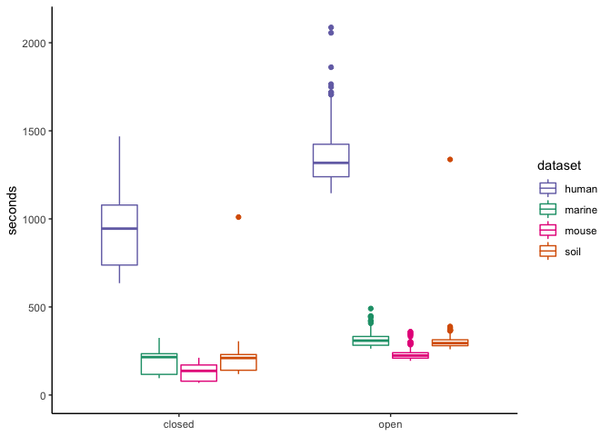

Exploratory Plots
================
Aug. 2020

``` r
library(cowplot)
library(ggtext)
library(here)
library(knitr)
library(tidyverse)
theme_set(theme_classic())
color_palette <- RColorBrewer::brewer.pal(4, "Dark2")
dataset_colors <- c(
  human = color_palette[[3]],
  marine = color_palette[[1]],
  mouse = color_palette[[4]],
  soil = color_palette[[2]]
)
```

``` r
sensspec_fit <-
  read_tsv(here('subworkflows/3_fit_sample_subset/results/sensspec.tsv'))
```

## Subsetting datasets with different reference sizes

``` r
sensspec_fit %>%
  group_by(dataset, method) %>%
  ggplot(aes(x = ref_frac, y = mcc, color = dataset)) +
  geom_point(alpha = 0.5) +
  scale_color_manual(values = dataset_colors) +
  ylim(0.5, 1) +
  facet_grid(method ~ ref_weight)
```

<!-- -->

sample fraction = 0.2

## Runtime

``` r
benchmarks_fit <-
  read_tsv(here('subworkflows/2_fit_reference_db/results/benchmarks.tsv'))
# TODO: show number of unique seqs, use as x axis?
benchmarks_fit %>% 
    group_by(dataset, method) %>%
    ggplot(aes(x = method, y = s, color = dataset)) +
    geom_boxplot() +
    scale_color_manual(values = dataset_colors) +
    #facet_wrap("ref_weight") +
    ylim(0,2100) +
    labs(y = 'seconds') +
    theme(axis.title.x = element_blank())
```

<!-- -->

## Fraction of sequences that map to the reference

``` r
fractions <- read_tsv(here('subworkflows/3_fit_sample_subset/results/fraction_reads_mapped.tsv'))
fractions %>% 
  group_by(dataset, ref_weight, ref_frac) %>% 
  ggplot(aes(x=ref_frac, y=fraction_mapped, color=dataset)) +
  geom_point(alpha = 0.5) +
  scale_color_manual(values = dataset_colors) +
  facet_wrap("ref_weight") +
  ylim(0, 1) +
  labs(title="Sequences mapped during closed-reference OptiFit")
```

<!-- -->
