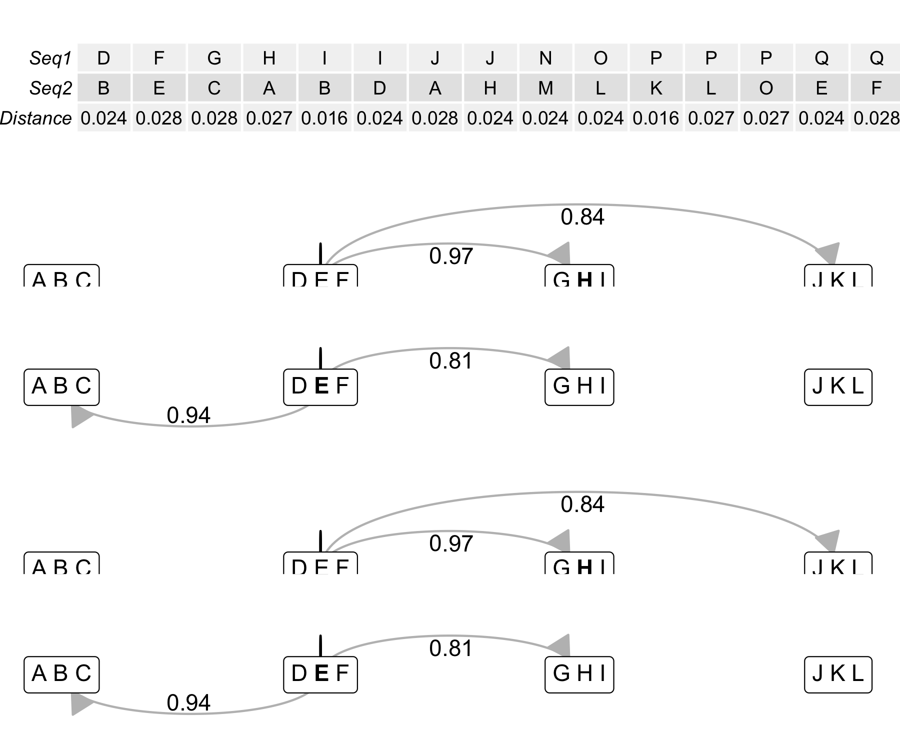
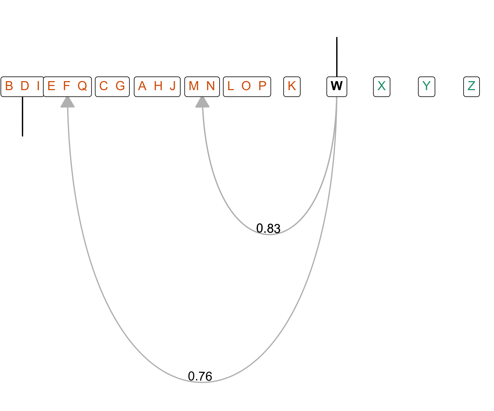
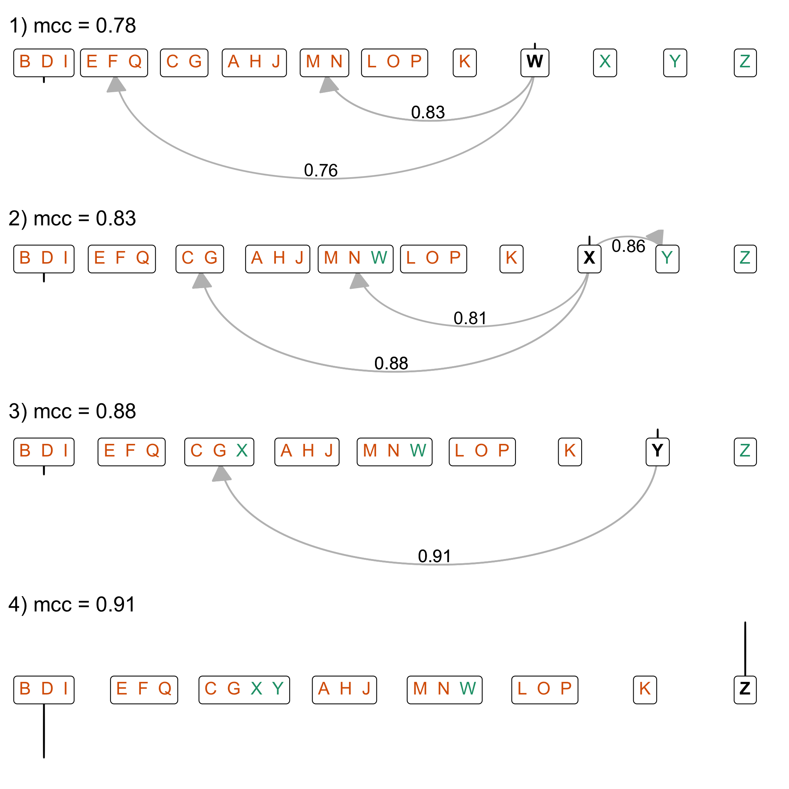

2021-07-16

``` r
library(here)
library(tidyverse)
library(diagram)
library(reticulate)
use_python('~/miniconda3/bin/python')
```

``` r
# Pat's MCC function
# source: https://github.com/SchlossLab/Westcott_OptiClust_mSphere_2017/blob/a8bc26855423bba85acc0b8e7cca075e5c94f533/submission/supplemental_text.Rmd#L26-L28
mcc <- function(tp, tn, fp, fn) {
  format(round((tp * tn - fp * fn) / 
                 sqrt((tp + fp) * (tp + fn) * (tn + fp) * (tn + fn)), 
               digits = 2),
  digits = 2,
  nsmall = 2L
  )
}

calc_mcc_from_conf_mat <- function(conf_mat) {
  tp <- conf_mat[1, 1]
  tn <- conf_mat[2, 2]
  fp <- conf_mat[1, 2]
  fn <- conf_mat[2, 1]
  return(mcc(tp, tn, fp, fn))
}

get_seqs_to_otus <- function(otu_list) {
  seqs_to_otus <- list()
  for (i in 1:length(otu_list)) {
    otu <- otu_list[[i]]
    for (seq in otu) {
      seqs_to_otus[seq] <- i
    }
  }
  return(seqs_to_otus)
}


get_otu_label <- function(otus, idx) {
  x <- otus[[idx]]
  paste0(x, collapse = ",")
}

# assignments of sequences in OTUs as matrix
get_otu_mat_from_list <- function(otu_list, seqs) {
  otu_mat <- matrix(
    nrow = length(seqs), ncol = length(seqs),
    dimnames = list(seqs, seqs), data = 0
  )
  for (i in 1:length(otu_list)) {
    otu <- otu_list[[i]]
    for (seq1 in otu) {
      for (seq2 in otu) {
        otu_mat[seq1, seq2] <- 1
        otu_mat[seq2, seq1] <- 1
      }
    }
  }
  return(otu_mat)
}

get_condition <- function(pair) {
  seq1 <- pair[1]
  seq2 <- pair[2]
  in_dist <- dist_mat[seq1, seq2]
  in_otu <- otu_mat[seq1, seq2]
  return(c(actual = in_dist, pred = in_otu))
}

# compare otu_mat to dist_mat to get tp/tn/fp/fn values
get_conf_mat <- function(pairs, dist_mat, otu_mat) {
  conditions <- apply(seq_pairs, 2, get_condition)
  conf_mat <- caret::confusionMatrix(table(
    conditions["pred", ],
    conditions["actual", ]
  )) %>%
    as.matrix()
  return(conf_mat)
}
```

``` r
# example data
seqs <- LETTERS[1:17]
seq_pairs <- combn(seqs, 2)
# distances within threshold
dist_dat <- data.frame(
  Seq1 = c("D", "F", "G", "H", "I", "I", "J", "J", "N", "O", "P", "P", "P", "Q", "Q"),
  Seq2 = c("B", "E", "C", "A", "B", "D", "A", "H", "M", "L", "K", "L", "O", "E", "F"),
  Distance = c(0.024, 0.028, 0.028, 0.027, 0.016, 0.024, 0.028, 0.024, 0.024, 0.024, 0.016, 0.027, 0.027, 0.024, 0.028)
)

# matrix of pairwise sequences within distance threshold
dist_mat <- matrix(
  nrow = length(seqs), ncol = length(seqs),
  dimnames = list(seqs, seqs), data = 0
)
diag(dist_mat) <- 1
for (i in 1:nrow(dist_dat)) {
  r <- dist_dat[i, ]
  seq1 <- r[["Seq1"]]
  seq2 <- r[["Seq2"]]
  dist_mat[seq1, seq2] <- 1
  dist_mat[seq2, seq1] <- 1
}

# example otu assignment
otu_list <- list(
  c("B", "D", "I"),
  c("E", "F"),
  c("C", "G"),
  c("A", "H", "J"),
  c("M", "N"),
  c("L", "O", "P"),
  c("K"),
  c("Q")
)
seqs_to_otus <- get_seqs_to_otus(otu_list)
otu_mat <- get_otu_mat_from_list(otu_list, seqs)
current_mcc <- calc_mcc_from_conf_mat(get_conf_mat(seq_pairs, dist_mat, otu_mat))

# Pat's method for plotting the network graph
# last example from OptiClust supplemental text
tp <- 14
tn <- 1210
fp <- 0
fn <- 1
names <- c( "B,D,I", "E,F,Q", "C,G", "A,H,J", "M,N", "L,O,P", "K", "...")
n_seqs <- length(names)
M <- matrix(nrow = n_seqs, ncol = n_seqs, byrow = TRUE, data = 0)
rownames(M) <- colnames(M) <- names
C <- matrix(nrow = n_seqs, ncol = n_seqs, byrow = TRUE, data = 0)
rownames(C) <- colnames(C) <- names

M["K","K"] <- mcc(tp=tp, tn=tn, fp=fp, fn=fn)
M["L,O,P", "K"] <- mcc(tp=tp+1, tn=tn-2, fp=fp+2, fn=fn-1)
C["L,O,P", "K"] <- 0.4

par(mar=c(1,2,1,2), xpd=T)

diagram::plotmat(M, pos=n_seqs, name = names, lwd = 1, curve=C, box.lwd = 2, 
        cex.txt = 0.6, box.size = 0.03, box.type = "circle", shadow.size=0, 
        arr.type="triangle", dtext=0.5, self.shiftx =-0.02, self.shifty=-0.04,
        xpd=T, box.cex=0.6, arr.length=0.3)
```

<!-- -->

## ggraph

can I make part of a node label bold? I modified
`ggraph::geom_node_label` to use `ggtext::geom_richtext` by default.

``` r
# devtools::install_github('kelly-sovacool/ggraph', ref = 'iss-297_ggtext')
#library(ggraph) # something is wrong & this fails, but load_all() works!
devtools::load_all('../ggraph')
library(ggtext)
library(tidygraph)
library(patchwork)
library(gridExtra)
g1 <-
  tbl_graph(nodes = data.frame(name = c("A B C", "D E F", "G **H** I", "J K L"),
                               id = 1:4),
            edges = data.frame(from = c(2, 2, 2), 
                               to = c(3, 4, 2), 
                               mcc = c(0.97, 0.84, 0.80)) %>% 
              mutate(is_loop = from == to))
g2 <-
  tbl_graph(nodes = data.frame(name = c("A B C", "D **E** F", "G H I", "J K L"),
                               id = 1:4),
            edges = data.frame(from = c(2, 2, 2), 
                               to = c(1, 3, 2), 
                               mcc = c(0.94, 0.81, 0.86)) %>% 
              mutate(is_loop = from == to))
```

## plot several optifit iterations

``` r
plot_graph <- function(graph) {
  create_layout(graph, 'linear', sort.by = id) %>% 
  ggraph() +
  geom_edge_arc(aes(label = mcc,
                    start_cap = label_rect(node1.name),
                    end_cap = label_rect(node2.name)), 
                arrow = arrow(length = unit(4, 'mm'),
                              type = 'closed'),
                edge_colour = 'gray',
                angle_calc = 'along',
                label_dodge = unit(-2, 'mm')
                ) +
  geom_edge_loop(aes(span = 1, direction = 270, strength = 0.2, color = is_loop)) +
  geom_node_label(aes(label = name)) +
    scale_edge_color_manual(values = c('white')) +
  theme_void() +
  theme(plot.margin=unit(x=c(0,0,10,0), units="pt"),
        legend.position = 'none')
}


pg1 <- plot_graph(g1) 
```

    ## Warning: Ignoring unknown parameters: parse

``` r
pg2 <- plot_graph(g2) 
```

    ## Warning: Ignoring unknown parameters: parse

``` r
wrap_elements(tableGrob(t(dist_dat),
                        theme = ttheme_default(base_size = 9, 
                                               padding = unit(c(4,8), 'pt')))
              ) /
((pg1 / pg2 / pg1 / pg2) + 
  plot_annotation(tag_levels = '1')) +
plot_layout(heights = c(1,4))
```

<!-- -->

## maybe I’ll do everything in python until the actual plotting step

``` r
reticulate::source_python(here('code', 'py', 'algorithm_diagram.py'))
optifit_iters <- run_optifit() %>% 
  lapply(function(x) {
    return(list(nodes = x[['nodes']] %>% py_to_r(),
                edges = x[['edges']] %>% py_to_r() %>% 
                 mutate(is_loop = from == to)))
    })
```

``` r
g <- tbl_graph(nodes = optifit_iters[[1]]$nodes,
               edges = optifit_iters[[1]]$edges)
plot_graph(g)
```

    ## Warning: Ignoring unknown parameters: parse

<!-- -->

``` r
lapply(optifit_iters, function(x) {
  tbl_graph(nodes = x$nodes, edges = x$edges) %>% 
    plot_graph()
}) %>% 
  wrap_plots(ncol = 1)
```

    ## Warning: Ignoring unknown parameters: parse

    ## Warning: Ignoring unknown parameters: parse

<!-- -->
