2021-03-07

``` r
set.seed(2018)
library(cowplot)
library(ggtext)
library(glue)
library(here)
library(knitr)
library(tidyverse)

theme_set(theme_classic())
color_palette <- RColorBrewer::brewer.pal(4, "Dark2")
dataset_colors <- c(
  human = color_palette[[3]],
  marine = color_palette[[1]],
  mouse = color_palette[[4]],
  soil = color_palette[[2]]
)
tri_colors <-  c("darkorange","darkorchid","cyan4") # https://allisonhorst.github.io/palmerpenguins/articles/intro.html
mutate_perf <- function(dat) {
  dat %>% 
    mutate(mem_mb = max_rss,
           mem_gb = mem_mb / 1024) %>% 
    rename(sec = s,
           num_otus = sobs)
}
```

## *de novo* clustering

``` r
opticlust <- read_tsv(here('subworkflows/1_prep_samples/results/opticlust_results.tsv')) %>% 
  full_join(read_tsv(here('subworkflows/1_prep_samples/results/dataset_sizes.tsv'))) %>% 
  mutate_perf()
sum_opticlust <- opticlust %>% 
  group_by(dataset) %>% 
  summarize(mcc_median = median(mcc),
            sec_median = median(sec),
            mem_gb_median = median(mem_gb))#,
            #median_shannon = median(shannon))
```

``` r
opticlust %>% 
  ggplot(aes(dataset, mcc)) +
  geom_jitter(alpha = 0.5) +
  ylim(0.5, 1)
```

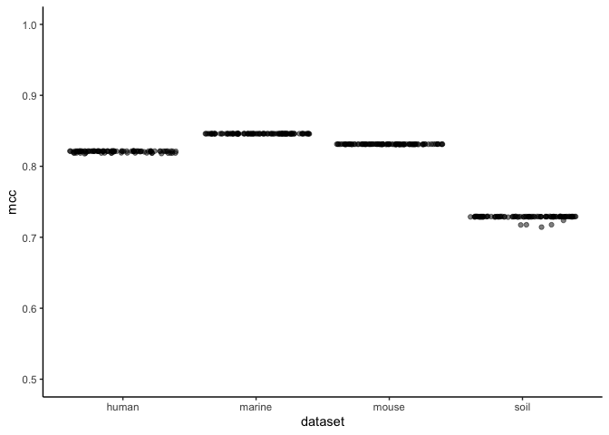<!-- -->

``` r
opticlust %>% 
  ggplot(aes(num_seqs, sec, color = dataset)) +
  geom_point(alpha = 0.5)
```

<!-- -->

## fit to reference databases

``` r
ref_sizes <- read_tsv(here('subworkflows/2_fit_reference_db/results/ref_sizes.tsv'))
optifit_dbs <- read_tsv(here('subworkflows/2_fit_reference_db/results/optifit_dbs_results.tsv')) %>% 
  mutate_perf()
```

``` r
optifit_dbs %>% 
  ggplot(aes(x=method, y=mcc, color=ref)) +
  geom_hline(aes(yintercept = mcc_median), sum_opticlust) +
  geom_boxplot() + 
  facet_wrap('dataset') +
  scale_color_manual(values=tri_colors) +
  ylim(0, 1) +
  labs(title='OTU Quality: OptiFit with reference databases',
       caption='Black line: _de novo_ clustering') +
  theme(plot.caption = element_markdown())
```

<!-- -->

``` r
optifit_dbs %>% filter(method == 'closed') %>% 
  ggplot(aes(x=dataset, y=fraction_mapped, color=ref)) +
  geom_boxplot() + 
  facet_wrap('method') +
  ylim(0, 1) +
  scale_color_manual(values=tri_colors) +
  labs(title="Sequences mapped during closed-reference OptiFit") +
  theme(plot.caption = element_markdown())
```

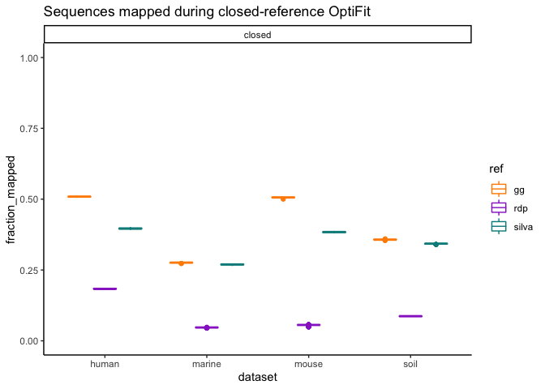<!-- -->

``` r
optifit_dbs %>% 
  ggplot(aes(x=method, y=sec, color=ref)) +
  geom_boxplot(alpha = 0.5) +
  geom_hline(aes(yintercept = sec_median), sum_opticlust) +
  facet_wrap('dataset', scales = 'free') +
  scale_color_manual(values=tri_colors) +
  labs(title='OptiFit runtime with reference databases',
       caption='Black line: _de novo_ clustering') +
  theme(plot.caption = element_markdown())
```

<!-- -->

``` r
optifit_dbs %>% 
  ggplot(aes(x=method, y=mem_gb, color=ref)) +
  geom_boxplot(alpha = 0.5) +
  geom_hline(aes(yintercept = mem_gb_median), sum_opticlust) +
  facet_wrap('dataset', scales = 'free') +
  scale_color_manual(values=tri_colors) +
  labs(title='OptiFit runtime with reference databases',
       caption='Black line: _de novo_ clustering') +
  theme(plot.caption = element_markdown())
```

<!-- -->

``` r
optifit_dbs %>% 
  ggplot(aes(x=method, y=shannon, color=ref)) +
  geom_jitter(alpha = 0.5) +
  geom_hline(aes(yintercept = median_shannon), sum_opticlust) +
  facet_wrap('dataset', scales = 'free') +
  scale_color_manual(values=tri_colors) +
  labs(title='OptiFit runtime with reference databases',
       caption='Black line: _de novo_ clustering') +
  theme(plot.caption = element_markdown())
```

## fit split datasets

``` r
optifit_split <- read_tsv(here('subworkflows/3_fit_sample_split/results/optifit_split_results.tsv')) %>% 
  mutate_perf()
```

``` r
optifit_split %>% 
  ggplot(aes(x = ref_frac, y = mcc, color = ref_weight)) +
  geom_jitter(size = 1, alpha = 0.3, width = 0.01) +
  stat_summary(fun = mean, geom = 'crossbar', alpha = 0.5) +
  geom_hline(aes(yintercept = mcc_median), sum_opticlust) +
  facet_grid(dataset ~ method) +
  ylim(0, 1) +
  labs(title='OTU Quality: OptiFit with split datasets',
       x='reference fraction',
       caption='Black line: _de novo_ clustering on the whole dataset') +
  theme(plot.caption = element_markdown())
```

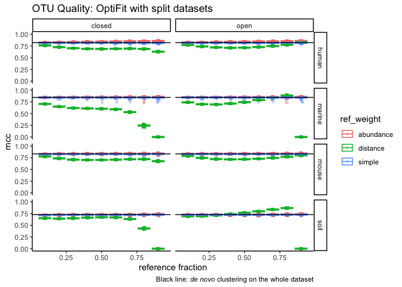<!-- -->

``` r
optifit_split %>% 
  ggplot(aes(x = ref_frac, y = sec, color = ref_weight)) +
  geom_jitter(size = 1, alpha = 0.3, width = 0.01) +
  stat_summary(fun = mean, geom = 'crossbar', alpha = 0.5) +
  geom_hline(aes(yintercept = sec_median), sum_opticlust) +
  facet_grid(dataset ~ method, scales = 'free') +
  labs(title='Runtime: OptiFit with split datasets',
       x='reference fraction',
       caption='Black line: _de novo_ clustering on the whole dataset') +
  theme(plot.caption = element_markdown())
```

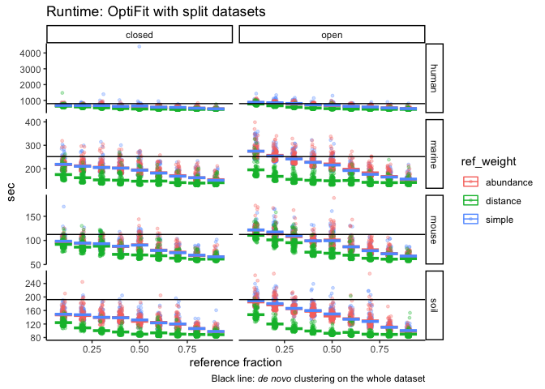<!-- -->

### fraction mapped

``` r
optifit_split %>% 
  filter(method == 'closed', tool == 'mothur', is.na(ref)) %>% 
  #group_by(dataset, ref_weight, ref_frac) %>% 
  ggplot(aes(x=ref_frac, y=fraction_mapped, color=ref_weight)) +
  geom_point(alpha = 0.5, size=1) +
  facet_wrap("dataset", nrow=1) +
  ylim(0, 1) +
  labs(title="Sequences mapped during closed-reference OptiFit",
       x='reference fraction',
       y='fraction mapped')
```

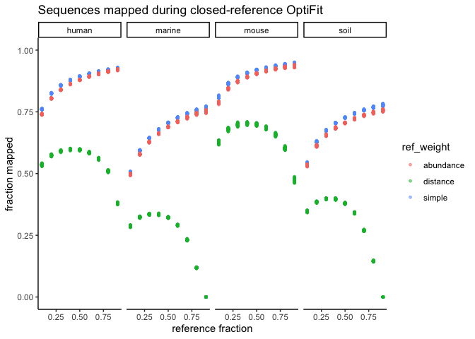<!-- -->

Let’s try a sanity check with open-reference – should all be 1.

``` r
optifit_split %>% 
  filter(tool == 'mothur', is.na(ref)) %>% 
  filter(dataset == 'soil') %>% 
  ggplot(aes(x=ref_frac, y=fraction_mapped, color=ref_weight)) +
  geom_point(alpha = 0.5, size=1) +
  facet_grid(dataset ~ method) +
  ylim(0, 1) +
  labs(title="Sequences mapped during OptiFit",
       x='reference fraction',
       y='fraction mapped',
       caption=glue("Ran with {optifit_split %>% pull(seed) %>% unique() %>% length()} seeds"))
```

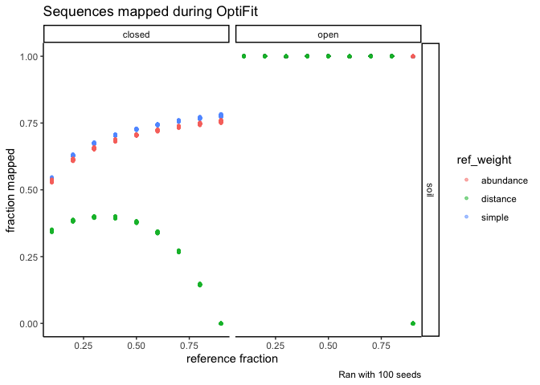<!-- -->

### diversity

``` r
optifit_split %>% 
  ggplot(aes(x = ref_frac, y = shannon, color = ref_weight)) +
  geom_jitter(size = 1, alpha = 0.3, width = 0.01) +
  stat_summary(fun = mean, geom = 'crossbar', alpha = 0.5) +
  geom_hline(aes(yintercept = median_shannon), sum_opticlust) +
  facet_grid(dataset ~ method, scales = 'free') +
  labs(title='Diversity: OptiFit with split datasets',
       x='reference fraction',
       caption='Black line: _de novo_ clustering on the whole dataset') +
  theme(plot.caption = element_markdown())
```

## vsearch

For reference-based clustering, datasets were fit to the greengenes
database.

``` r
vsearch <- read_tsv(here('subworkflows/4_vsearch/results/vsearch_results.tsv')) %>% 
  mutate_perf()
vsearch_join <- vsearch %>% 
  full_join(opticlust) %>% 
  full_join(optifit_dbs %>% filter(ref == 'gg'))
```

``` r
vsearch_join %>% 
  ggplot(aes(x = method, y = mcc, color = tool)) +
  geom_boxplot() +
  facet_wrap('dataset') +
  ylim(0, 1) + 
  labs(x = '')
```

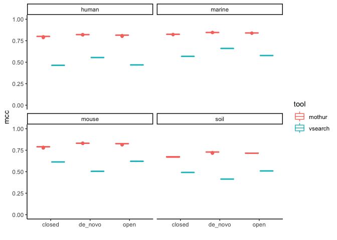<!-- -->

``` r
vsearch_join %>% 
  ggplot(aes(x = method, y = sec, color = tool)) +
  geom_boxplot() +
  facet_wrap('dataset') +
  labs(x = '')
```

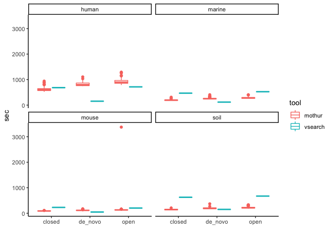<!-- -->

``` r
vsearch_join %>% 
  ggplot(aes(x = method, y = shannon, color = tool)) +
  geom_boxplot() +
  facet_wrap('dataset') +
  labs(x = '')
```

    ## Warning: Removed 400 rows containing non-finite values (stat_boxplot).

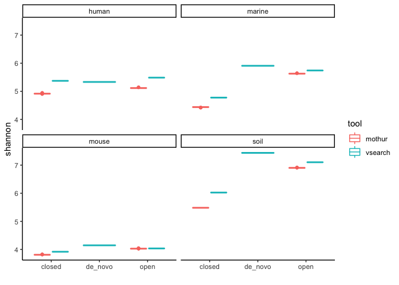<!-- -->

``` r
vsearch_join %>% #filter(method == 'closed') %>% 
  ggplot(aes(x = dataset, y = fraction_mapped, color = tool)) +
  geom_boxplot() + 
  ylim(0, 1) +
  facet_wrap('method') +
  labs(title="Sequences mapped during closed-reference OptiFit") +
  theme(plot.caption = element_markdown())
```

    ## Warning: Removed 400 rows containing non-finite values (stat_boxplot).

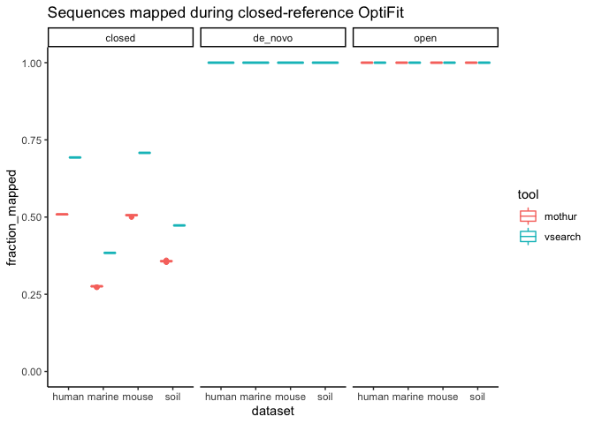<!-- -->

The fraction mapped for *de novo* open-reference is shown here as a
sanity check. Final plots will only include closed-reference.

## compare all mothur clustering strategies

``` r
plot_denovo_hline <- function(yint, dat = sum_opticlust) {
  list(geom_hline(data = dat, aes(yintercept = {{yint}})),
       labs(caption = "Black line: _de novo_ clustering0"),
       theme(plot.caption = element_markdown())
  )
}

optifit_all <- list(optifit_dbs %>% 
                   mutate(strategy = glue('database_{ref}')),
                 optifit_split %>% 
                   mutate(strategy = 'self-split')) %>% 
  reduce(full_join)

sum_optifit <- optifit_all %>% 
  group_by(dataset, strategy, method) %>% 
  summarize(n = n(),
            mcc_median = median(mcc),  # TODO: tidy way to avoid this repetitiveness?
            sec_median = median(sec),
            mem_gb_median = median(mem_gb),
            frac_map_median = median(fraction_mapped))
head(sum_optifit)
```

    ## # A tibble: 6 x 8
    ## # Groups:   dataset, strategy [3]
    ##   dataset strategy method     n mcc_median sec_median mem_gb_median
    ##   <chr>   <glue>   <chr>  <int>      <dbl>      <dbl>         <dbl>
    ## 1 human   databas… closed   100      0.800       606.          5.38
    ## 2 human   databas… open     100      0.815       899.         20.3 
    ## 3 human   databas… closed   100      0.597       476.          5.10
    ## 4 human   databas… open     100      0.819       991.         20.0 
    ## 5 human   databas… closed   100      0.780       549.          5.22
    ## 6 human   databas… open     100      0.817       886.         20.1 
    ## # … with 1 more variable: frac_map_median <dbl>

``` r
sum_optifit %>% 
  ggplot(aes(strategy, mcc_median, color = method)) +
  geom_point() +
  facet_wrap(dataset ~ ., nrow=1) +
  scale_color_manual(values = tri_colors) +
  ylim(0, 1) +
  #theme(axis.text.x = element_text(angle = 90, vjust = 0.5, hjust=1)) + 
  coord_flip() +
  labs(title = 'OTU Quality', x = '', y = 'Median MCC') + 
  plot_denovo_hline(yint = mcc_median)
```

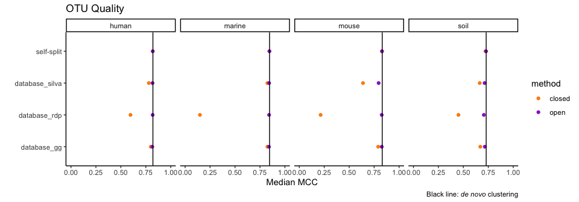<!-- -->

``` r
sum_optifit %>% 
  ggplot(aes(strategy, sec_median, color = method)) +
  geom_point() +
  facet_wrap(dataset ~ ., scales = 'free_y') +
  scale_color_manual(values = tri_colors) +
  theme(axis.text.x = element_text(angle = 45, vjust = 1, hjust=1)) +
  plot_denovo_hline(sec_median)
```

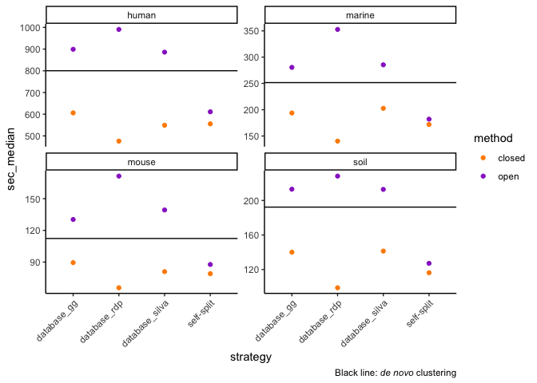<!-- -->

``` r
sum_optifit %>% 
  ggplot(aes(strategy, mem_gb_median, color = method)) +
  geom_point() +
  facet_wrap(dataset ~ ., scales = 'free_y') +
  scale_color_manual(values = tri_colors) +
  theme(axis.text.x = element_text(angle = 90, vjust = 0.5, hjust=1)) +
  plot_denovo_hline(mem_gb_median)
```

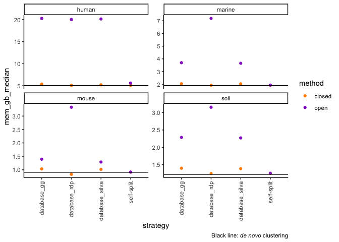<!-- -->

``` r
sum_optifit %>% 
  ggplot(aes(strategy, frac_map_median, color = method)) +
  geom_point() +
  facet_wrap(dataset ~ .) +
  scale_color_manual(values = tri_colors) +
  theme(axis.text.x = element_text(angle = 90, vjust = 0.5, hjust=1))
```

<!-- -->

## compare mothur & vsearch with just the human dataset

``` r
all_human <- list(optifit_all %>% 
                    filter(dataset == 'human', 
                           ref == 'gg' | method == 'de_novo'),
                  opticlust %>% filter(dataset == 'human'),
                  vsearch %>% filter(dataset == 'human')
                 ) %>% 
  reduce(full_join) %>% 
  mutate(strategy = case_when(
    method == 'de_novo' ~ method,
    TRUE ~ as.character(glue('{method}_ref_{ref}'))))

sum_all_human <- all_human %>% 
  group_by(tool, strategy, method) %>% 
  summarize(n = n(),
            mcc_median = median(mcc),  # TODO: tidy way to avoid this repetitiveness?
            sec_median = median(sec),
            mem_gb_median = median(mem_gb),
            frac_map_median = median(fraction_mapped))
head(sum_all_human)
```

    ## # A tibble: 6 x 8
    ## # Groups:   tool, strategy [6]
    ##   tool  strategy method     n mcc_median sec_median mem_gb_median
    ##   <chr> <chr>    <chr>  <int>      <dbl>      <dbl>         <dbl>
    ## 1 moth… closed_… closed   100      0.800       606.         5.38 
    ## 2 moth… de_novo  de_no…   100      0.821       718.         5.05 
    ## 3 moth… open_re… open     100      0.815       899.        20.3  
    ## 4 vsea… closed_… closed     1      0.464       684.         0.557
    ## 5 vsea… de_novo  de_no…     1      0.554       153.         0.165
    ## 6 vsea… open_re… open       1      0.469       715.         0.559
    ## # … with 1 more variable: frac_map_median <dbl>

``` r
sum_all_human %>% 
  ggplot(aes(strategy, mcc_median, color = tool)) +
  geom_point() +
  #facet_wrap(tool ~ .) +
  ylim(0, 1) +
  scale_color_manual(values = tri_colors) +
  #theme(axis.text.x = element_text(angle = 90, vjust = 0.5, hjust=1)) + 
  coord_flip()
```

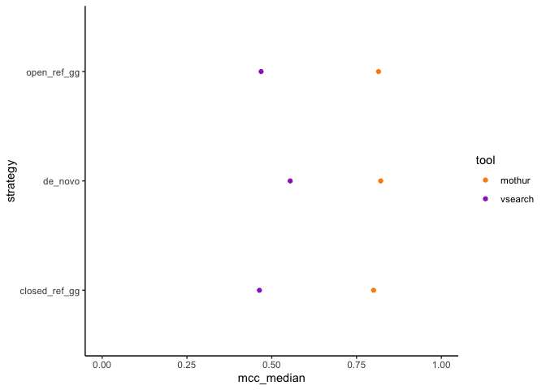<!-- -->

``` r
sum_all_human %>% 
  pivot_longer(c(mcc_median, sec_median, mem_gb_median, frac_map_median), names_to = 'metric') %>% 
  ggplot(aes(strategy, value, color = tool)) +
  geom_point() +
  facet_wrap('metric', scales = 'free')
```

    ## Warning: Removed 1 rows containing missing values (geom_point).

<!-- -->

``` r
all_human %>% 
  pivot_longer(c(mcc, sec, mem_gb, fraction_mapped), names_to = 'metric') %>% 
  ggplot(aes(strategy, value, color = tool)) +
  geom_boxplot() +
  facet_wrap('metric', scales = 'free_y', nrow=1) +
  labs(x='', y='',  
       caption = 'Only the human dataset is shown here. The patterns are similar with other datasets.') +
  theme(axis.text.x = element_text(angle = 45, vjust = 1, hjust=1))
```

    ## Warning: Removed 100 rows containing non-finite values (stat_boxplot).

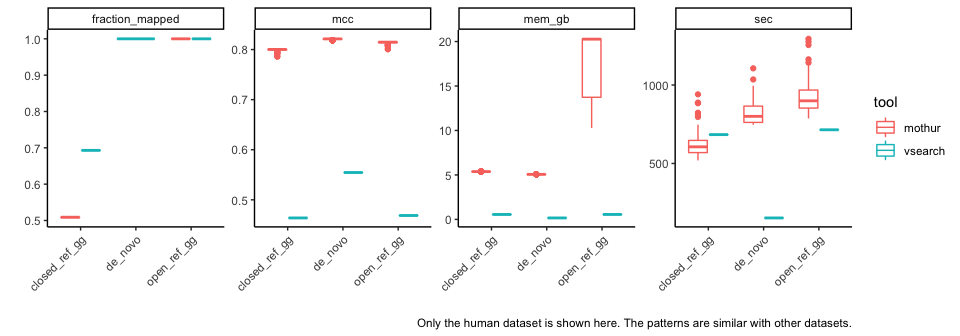<!-- -->
