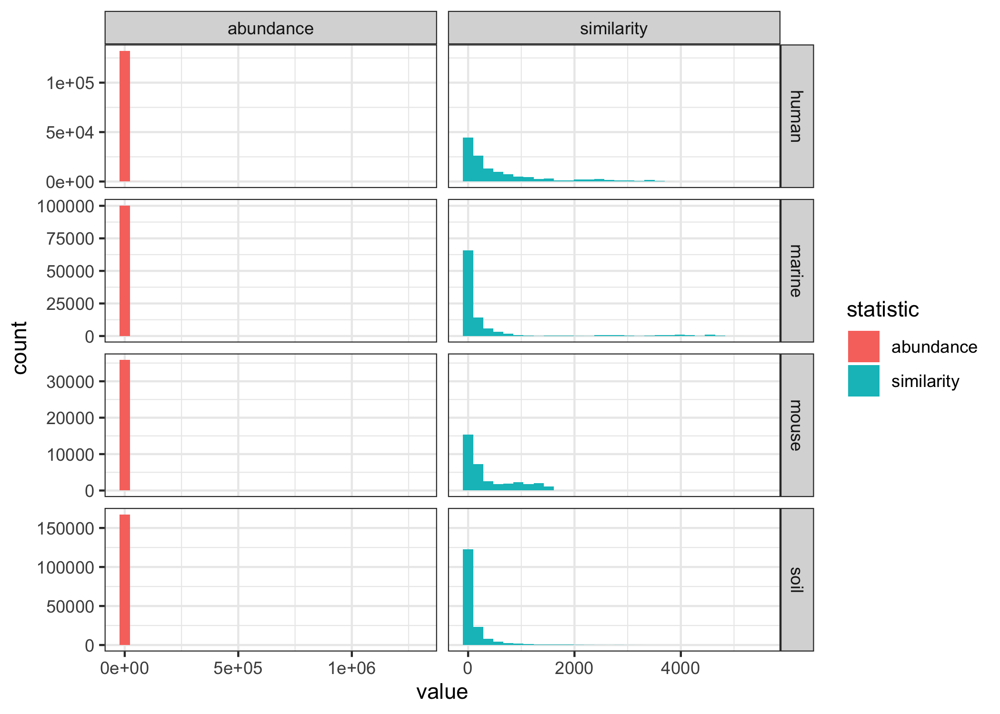
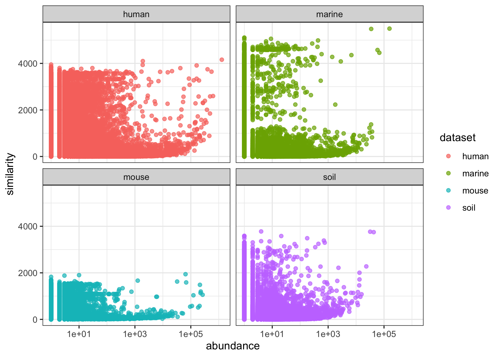

2021-10-21

# Similarity & Abundance of Sequences

``` r
set.seed(20211021)
library(glue)
library(here)
library(tidyverse)
theme_set(theme_bw())
```

``` r
seq_stats <- c("human","marine","mouse","soil") %>% map_dfr(function(x) {
  read_tsv(glue('subworkflows/1_prep_samples/data/{x}/seq_stats.tsv')) %>% 
    mutate(dataset = x)
}) %>% pivot_longer(c(similarity, abundance), names_to = 'statistic')
```

``` r
seq_stats %>% 
  ggplot(aes(x=value, fill=statistic)) +
  geom_histogram() +
  facet_grid(dataset ~ statistic, scales='free')
```

<!-- -->

## log10

``` r
seq_stats %>% 
  ggplot(aes(x=value, fill=statistic)) +
  geom_histogram() +
  scale_x_log10() +
  facet_wrap("dataset")
```

    ## Warning: Transformation introduced infinite values in continuous x-axis

    ## Warning: Removed 34675 rows containing non-finite values (stat_bin).

<!-- -->

## abundance vs similarity

``` r
seq_stats %>% 
  pivot_wider(names_from = statistic) %>% 
  ggplot(aes(x = abundance, y = similarity, color = dataset)) +
  geom_point(alpha=0.7) +
  scale_x_log10() +
  facet_wrap('dataset')
```

<!-- -->
